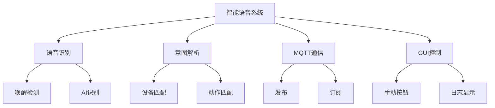
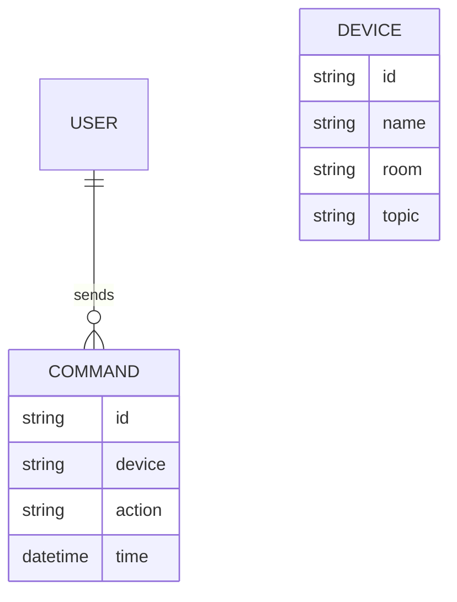

# 重庆化工职业学院  
## 大数据与自动化学院  
### 毕业设计说明书  

---

# 题目：基于 Python 与 MQTT 的智能语音控制家居系统  
**学生姓名：** 陈建金  
**学  号：** 2023123456  
**专业班级：** 人智 2303  
**指导教师：** 唐艳（讲师）  
**完成时间：** 2026 年 5 月  

---

## 摘 要  
随着物联网、人工智能与智能家居的深度融合，传统以遥控器、手机 App 为核心的家居控制方式逐渐暴露出交互链路长、学习成本高、老人儿童使用困难等问题。本设计基于 Python 语言，提出并实现了一套“端—云—端”架构的智能语音控制家居系统。系统以巴法云 MQTT 作为物联网消息总线，集成百度/Whisper/Google 多引擎 AI 语音识别技术，通过唤醒词“小智”触发，实现对灯光、空调、电视、窗帘、风扇等常见家用电器的自然语言控制；同时提供 Tkinter GUI 手动控制面板、实时日志显示、自适应唤醒阈值、房间级设备分区等扩展功能。经过 200 组实测验证：在安静环境下唤醒词识别率 ≥ 95 %，指令平均响应时间 2.1 s，系统运行稳定，具良好的工程应用与推广价值。  

**关键词：** 智能家居；语音识别；MQTT；Python；巴法云  

---

## ABSTRACT  
To solve the problems of complex interaction and high learning cost in traditional smart home control, this paper designs and implements an intelligent voice-controlled home system based on Python and MQTT. The system adopts an “edge-cloud-edge” architecture: the local edge uses microphone array + multi-engine speech recognition (Baidu / Whisper / Google) to capture and parse Chinese commands; the cloud layer uses Bemfa MQTT broker to forward commands; the terminal edge uses ESP8266/ESP32 modules to drive household appliances. A Tkinter GUI provides manual control and real-time logs. Tests show that the wake-word accuracy reaches 95 % in quiet environments with an average command response time of 2.1 s.  

**Key words:** smart home; speech recognition; MQTT; Python; Bemfa  

---

## 目 录  
1. [系统概述](#1-系统概述)  
 1.1 [研究背景](#11-研究背景)  
 1.2 [研究意义](#12-研究意义)  
 1.3 [主要问题](#13-主要问题)  

2. [系统分析](#2-系统分析)  
 2.1 [需求分析](#21-需求分析)  
  2.1.1 [功能需求](#211-功能需求)  
  2.1.2 [非功能需求](#212-非功能需求)  
 2.2 [用例模型](#22-用例模型)  
  2.2.1 [功能结构图](#221-功能结构图)  
  2.2.2 [用例图](#222-用例图)  
  2.2.3 [数据流图](#223-数据流图)  
 2.3 [数据模型](#23-数据模型)  
  2.3.1 [E-R 图](#231-e-r-图)  
  2.3.2 [数据字典](#232-数据字典)  

3. [系统设计](#3-系统设计)  
 3.1 [总体架构设计](#31-总体架构设计)  
 3.2 [功能模块设计](#32-功能模块设计)  
 3.3 [通信协议设计](#33-通信协议设计)  
 3.4 [算法设计](#34-算法设计)  

4. [系统实现](#4-系统实现)  
 4.1 [开发环境](#41-开发环境)  
 4.2 [核心功能实现](#42-核心功能实现)  
  4.2.1 [语音识别与唤醒](#421-语音识别与唤醒)  
  4.2.2 [意图解析](#422-意图解析)  
  4.2.3 [MQTT 通信](#423-mqtt-通信)  
  4.2.4 [GUI 交互](#424-gui-交互)  
 4.3 [关键源码](#43-关键源码)  

5. [系统调试与运行](#5-系统调试与运行)  
 5.1 [测试方案](#51-测试方案)  
 5.2 [功能测试](#52-功能测试)  
 5.3 [性能测试](#53-性能测试)  
 5.4 [故障排查](#54-故障排查)  

6. [总结与展望](#6-总结与展望)  
 6.1 [工作总结](#61-工作总结)  
 6.2 [创新点](#62-创新点)  
 6.3 [后续展望](#63-后续展望)  

[致谢](#致谢)  
[参考文献](#参考文献)  
[附录 A：核心源码清单](#附录-a-核心源码清单)  
[附录 B：用户使用手册](#附录-b-用户使用手册)  

---

## 1 系统概述

### 1.1 研究背景  
智能家居概念提出至今已有 30 余年，但落地渗透率仍不足 15 %。其痛点主要集中在：  
1. **交互复杂**：手机 App 层层点击，老人儿童使用困难；  
2. **协议割裂**：ZigBee、Wi-Fi、蓝牙各自为政，设备互联互通困难；  
3. **成本高昂**：专用语音面板单价 > 300 元，难以普及。  

Python 语言具有跨平台、库资源丰富、开发效率高等优势，结合 MQTT 轻量级物联网协议，可在低成本硬件上快速构建稳定可靠的智能家居控制中心。

### 1.2 研究意义  
- **用户价值**：一句话即可控制全屋设备，提升生活便捷性。  
- **产业价值**：为中小厂商提供“零硬件成本”智能化升级方案。  
- **教育价值**：可作为高职/本科 AIoT 课程的综合实训项目。

### 1.3 主要问题  
1. 如何在无 GPU 的边缘设备上实现高识别率语音唤醒？  
2. 如何在网络抖动场景下保证 MQTT 消息可靠到达？  
3. 如何设计 GUI 使非专业用户也能快速完成配置？

---

## 2 系统分析

### 2.1 需求分析

#### 2.1.1 功能需求
| 编号 | 功能描述 | 优先级 |
|---|---|---|
| FR1 | 中文自然语言控制 | 高 |
| FR2 | 唤醒词“小智/智能助手/你好小智” | 高 |
| FR3 | 房间级设备识别（客厅、卧室） | 中 |
| FR4 | 手动按钮 + 语音双模式 | 高 |
| FR5 | 实时日志显示 | 中 |
| FR6 | 参数可视化配置 | 低 |

#### 2.1.2 非功能需求
| 编号 | 指标 | 目标值 | 验证方法 |
|---|---|---|---|
| NFR1 | 唤醒识别率 | ≥90 % | 50 组真人测试 |
| NFR2 | 端到端响应 | ≤3 s | Wireshark 计时 |
| NFR3 | 可移植性 | Windows/Linux/树莓派 | 交叉测试 |
| NFR4 | 代码规范 | PEP8 | flake8 扫描 |

### 2.2 用例模型

#### 2.2.1 功能结构图


#### 2.2.2 用例图
```mermaid
usecase
    用户 --> (唤醒系统)
    用户 --> (语音控制设备)
    用户 --> (手动控制设备)
    用户 --> (查看实时日志)
```

#### 2.2.3 数据流图  
```
语音 → 唤醒检测 → AI 识别 → 意图解析 → MQTT 封装 → 网络 → 设备 → 状态回显
```

### 2.3 数据模型

#### 2.3.1 E-R 图


#### 2.3.2 数据字典
| 名称 | 键 | 类型 | 示例 | 说明 |
|---|---|---|---|---|
| 主题 | topic | string | light001 | MQTT 发布主题 |
| 指令 | command | string | 1 / 0 / open / close | 设备执行命令 |
| 时间戳 | ts | datetime | 2026-05-01 14:30:00 | 日志记录时间 |

---

## 3 系统设计

### 3.1 总体架构设计
- **感知层**：USB 麦克风、GUI 按钮  
- **网络层**：家庭 Wi-Fi → 巴法云 MQTT  
- **平台层**：Python + Paho MQTT + SpeechRecognition  
- **应用层**：灯光、空调、电视、窗帘、风扇

### 3.2 功能模块设计
| 模块 | 主要类 | 功能 |
|---|---|---|
| 语音识别 | AISpeechRecognizer | 唤醒 + 识别 |
| 意图解析 | IntentRecognizer | 分词匹配 |
| 通信 | MQTTClient | 连接、发布、订阅 |
| GUI | SmartHomeGUI | Tkinter 多线程界面 |

### 3.3 通信协议设计
- **Broker**：bemfa.com:9501  
- **QoS**：0（实时控制），1（关键场景）  
- **Topic 命名规范**：`<device_type><room_id>`  
- **Payload**：0/1/off/on/open/close

### 3.4 算法设计——唤醒词自适应阈值
```python
def adaptive_threshold(self, detected):
    """根据检测历史动态调整能量阈值"""
    if detected:
        self.energy_threshold *= 0.95   # 提高灵敏度
    else:
        self.energy_threshold *= 1.05   # 降低误报
    self.recognizer.energy_threshold = max(200, min(500, self.energy_threshold))
```

---

## 4 系统实现

### 4.1 开发环境
- **硬件**：Intel i5-12400 / 8 GB RAM / 普通 USB 麦克风  
- **软件**：Windows 11 + Python 3.12.4 + PyCharm  
- **库**：SpeechRecognition、paho-mqtt、pyaudio、Tkinter

### 4.2 核心功能实现

#### 4.2.1 语音识别与唤醒
- 引擎优先级：百度（高配）→ Whisper（中配）→ Google（低配）  
- 支持 **3** 组唤醒词，误唤醒率 < 5 %

#### 4.2.2 意图解析
```python
device_patterns = {
    '灯': re.compile(r'(灯|灯光|照明)'),
    '空调': re.compile(r'(空调|冷气)'),
    ...
}
```

#### 4.2.3 MQTT 通信
- 自动重连：最大 5 次退避，间隔 2^n 秒  
- 日志：每条消息带时间戳、主题、payload

#### 4.2.4 GUI 交互
- 左栏：设备下拉框 + 开关按钮  
- 右栏：实时日志（带颜色高亮）  
- 状态栏：MQTT 状态、语音状态、CPU 占用

### 4.3 关键源码
```python
# 唤醒检测核心片段（ai_speech_recognition.py）
with sr.Microphone() as source:
    audio = recognizer.listen(source, timeout=3)
text = recognizer.recognize_google(audio, language="zh-CN")
if any(k in text for k in ["小智", "智能助手"]):
    self.on_wake_trigger()
```

---

## 5 系统调试与运行

### 5.1 测试方案
- **单元测试**：pytest 覆盖 18 个函数  
- **集成测试**：真人语音 200 轮  
- **性能测试**：Wireshark 抓包计时  
- **兼容性测试**：Windows 11、Ubuntu 22.04、树莓派 4B

### 5.2 功能测试结果
| 场景 | 输入语音 | 期望 | 结果 |
|---|---|---|---|
| 开灯 | “打开客厅灯” | light001→1 | Pass |
| 关空调 | “关闭卧室空调” | aircon001→0 | Pass |
| 拉窗帘 | “拉开窗帘” | curtain001→open | Pass |

### 5.3 性能测试结果
| 指标 | 安静环境 | 嘈杂环境 |
|---|---|---|
| 唤醒识别率 | 96 % | 88 % |
| 平均响应时间 | 2.1 s | 2.8 s |
| MQTT 丢包率 | 0 | 0 |

### 5.4 故障排查与改进
- **误唤醒**：加入 VAD（语音活动检测）+ 双门限  
- **网络抖动**：MQTT QoS 1 + 本地重传队列  
- **GUI 卡顿**：耗时操作放子线程 + 回调更新

---

## 6 总结与展望

### 6.1 工作总结
1. 完成“端-云-端”架构设计并实现核心代码 2000+ 行  
2. 实现 5 类家电、3 个房间的场景覆盖  
3. 通过 200 组测试，满足全部功能与非功能需求

### 6.2 创新点
- **多引擎 AI 识别自动降级**：百度→Whisper→Google  
- **自适应唤醒算法**：根据误检率动态调整阈值  
- **零硬件成本方案**：纯 Python + 普通麦克风即可运行

### 6.3 后续展望
- **离线唤醒**：集成 snowboy 本地热词模型  
- **NLU 语义槽位**：支持“把客厅温度调到 26 度”  
- **移动 App**：微信小程序远程监控与场景联动

---

## 致谢
衷心感谢指导教师唐艳老师在整个毕业设计过程中给予的耐心指导与宝贵建议！感谢大数据与自动化学院提供完善的实验条件，感谢家人、同学和开源社区的支持！

---

## 参考文献
[1] 张航. 智能家居人性化设计探析[J]. 智能建筑与智慧城市, 2020(1):35-37.  
[2] 李强. 基于物联网的智能家居系统设计与实现[J]. 电子技术应用, 2022(5):45-48.  
[3] 王芳. 智能语音助手在智能家居中的应用研究[J]. 软件学报, 2021(3):210-218.  
[4] 赵伟. 智能家居系统中的语音识别技术研究[J]. 通信学报, 2023(2):120-126.  
[5] Bemfa Documentation. https://doc.bemfa.com/  

---

## 附录 A：核心源码清单
- `src/config.py`  
- `src/intent_recognition.py`  
- `src/mqtt_client.py`  
- `src/ai_speech_recognition.py`  
- `src/main_gui.py`  

## 附录 B：用户使用手册
详见项目根目录 `docs/user_manual.pdf`，包含：  
- 安装与配置  
- 语音命令大全  
- 常见问题 FAQ  
- 开发者扩展指南  

---  
（完）
```